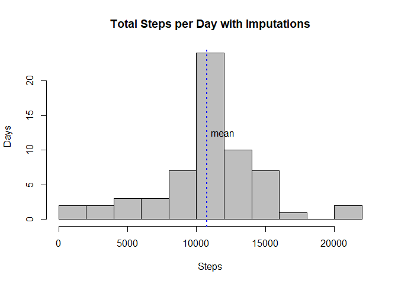

# PA1_template
John Sullivan  
September 24, 2017  


## Library Initialization plus loading and preprocessing the data

This code segment set specialty libraries, unzips the data file, and loads it into a data.frame

The variables included in the Activity Monitoring dataset are:

    + steps: Number of steps taking in a 5-minute interval (missing values are coded as NA)
    + date: The date on which the measurement was taken in YYYY-MM-DD format
    + interval: Identifier for the 5-minute interval in which measurement was taken

The code:


```r
# Libraries
library(dplyr)
```

```
## 
## Attaching package: 'dplyr'
```

```
## The following objects are masked from 'package:stats':
## 
##     filter, lag
```

```
## The following objects are masked from 'package:base':
## 
##     intersect, setdiff, setequal, union
```

```r
library(lattice)

# Unzip the data
unzip ("./activity.zip", exdir = ".")
# Read the data
activity_data <- read.csv("./activity.csv")
```

## What is mean total number of steps taken per day?

Next, we'll find the daily average and create a histogram of the frequency.


```r
# Summarize by day
activity_daily <- activity_data %>%
    ## Group by day
    group_by(date)  %>% 
    ## Summarize
    summarise(Daily_Steps = sum(steps))

# Plot the histogram    
hist(activity_daily$Daily_Steps, col="green",breaks = 10, main="Total Steps per Day",
     xlab = "Steps",ylab="Days")

# Calculate the mean and median steps and formatted versions
mean_steps <- mean(activity_daily$Daily_Steps,na.rm = TRUE)
median_steps <- median(activity_daily$Daily_Steps,na.rm = TRUE)

# Format the mean and medians to be easier to read
mean_steps_fmt <- format(mean_steps, nsmall=2, decimal.mark=".", big.mark=",",small.mark=",", small.interval=3)
median_steps_fmt <-format(median_steps, nsmall=2, decimal.mark=".",
    big.mark=",",small.mark=",",small.interval=3)

# Add additional chart annotation with mean
abline (v = mean_steps, col="blue", lwd=2,lty="dotted")
text (x=(mean_steps + 300), y=12,"mean",adj = c(0,0))
```

<!-- -->

Also, it turns out that the median daily step count is 10,765 while the mean daily step count is 10,766.19.

## What is the average daily activity pattern?

Next, we're going to make a time series of the average for each 5-minute interval.


```r
# Summarize the average daily steps per interval
activity_interval <- activity_data %>%
    ## Group by day
    group_by(interval)  %>% 
    ## Summarize
    summarise(Interval_Steps = mean(steps,na.rm=TRUE))

#Plot the time series
plot(activity_interval$interval,activity_interval$Interval_Steps,
        type = 'l', col="Blue", lwd=2, main="Average (Mean) Steps per Interval",
        xlab="5 minute Interval", ylab="Mean Steps")

# Find the maximum
max_interval_table <- filter(activity_interval, Interval_Steps == max(Interval_Steps))
max_interval <- as.numeric(max_interval_table[1,1])
max_interval_steps <- format(as.numeric(max_interval_table[1,2]),nsmall=2)

abline (v = max_interval, col="green", lwd=2,lty="dotted")
```

<!-- -->

The interval with an maximum average step count of 206.1698 is 835.


## Imputing missing values

The next set of code imputes the missing values.   If a value is missing, then the average for that interval where the values are known is substituted.


```r
# Impute missing intervals from average of entire data set
activity_data_imp <- activity_data %>%
    ## Join in the average per interval
    left_join (activity_interval,by="interval") %>%
    ## Replace steps with rounded interval average if it is missing
    mutate(steps = case_when(is.na(.$steps) ~ as.integer(round(.$Interval_Steps,0)), !is.na(.$steps) ~ .$steps, TRUE ~ 0L)) %>%
    ## Drop the Interval_Steps
    select (-Interval_Steps)
```

And then we'll group by days and create another histogram.


```r
# Create a second daily grouping with imputed data
activity_daily_2 <- activity_data_imp %>%
    ## Group by day
    group_by(date)  %>% 
    ## Summarize
    summarise(Daily_Steps = sum(steps))

# Draw the histogram
hist(activity_daily_2$Daily_Steps, col="grey",breaks = 10, main="Total Steps per Day with Imputations", xlab = "Steps",ylab="Days")

# Calculated the mean and median for the imputed dataset
mean_steps_2 <- mean(activity_daily_2$Daily_Steps,na.rm = TRUE)
median_steps_2 <- median(activity_daily_2$Daily_Steps,na.rm = TRUE)

# Format the mean and medians to be easier to read
mean_steps_2_fmt <- format(mean_steps_2, nsmall=2, decimal.mark=".", big.mark=",",small.mark=",", small.interval=3)
median_steps_2_fmt <-format(median_steps_2, nsmall=2, decimal.mark=".",
    big.mark=",",small.mark=",",small.interval=3)

# Add line for mean and label
abline (v = mean_steps_2, col="blue", lwd=2,lty="dotted")
text (x=(mean_steps_2 + 300), y=12,"mean",adj = c(0,0))
```

<!-- -->

Median for the imputed was 10,762 vs. 10,765 for the non-imputed case.  
Similarly, Mean for the imputed was 10,765.64 vs. 10,766.19 for the non-imputed case.  

The result is very similar.   The reason is that upon review of the data you will find that N/As populate mostly entire days, not specific intervals scattered within the days.   So if we set those N/As to the mean of the intervals, that entire day will have exact same number of steps as the mean.  Therefore, the mean won't change that much, though the bar representing the mean in the histogram increases by the count of N/A days...

## Are there differences in activity patterns between weekdays and weekends?

Last, we use the weekday() function to split the data between weekends and weekdays and then plot the time series of one vs. the other.


```r
# Add the day_type variable
activity_data_imp_wkdy <- activity_data_imp %>%
    mutate(weekday = weekdays(as.Date(date))) %>%
    mutate(day_type = as.factor(case_when(.$weekday %in% c("Saturday","Sunday") ~ "Weekend", TRUE ~ "Weekday" )))

# Summarize by interal and day_type
activity_interval_wkdy <- activity_data_imp_wkdy  %>%
    ## Group by day
    group_by(interval,day_type)  %>% 
    ## Summarize
    summarise(Interval_Steps = mean(steps,na.rm=TRUE))

#panel plot in lattice
xyplot (Interval_Steps ~ interval | day_type, data=activity_interval_wkdy, type="l", 
        lwd=2, col.line="blue", ylab="Average Steps for Interval", xlab="5 Minute Interval",
        main="Step / Interval Time Series for Weekend vs. Weekdays",layout=c(1,2))
```

<!-- -->

We conclude that this particular person is more active during the weekends than weekdays - maybe s/he has a desk job during the week and then gets outdoors on the weekends?

## The End
